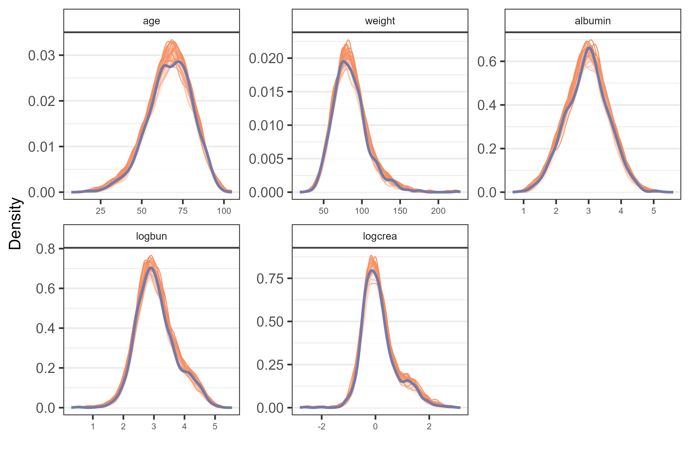
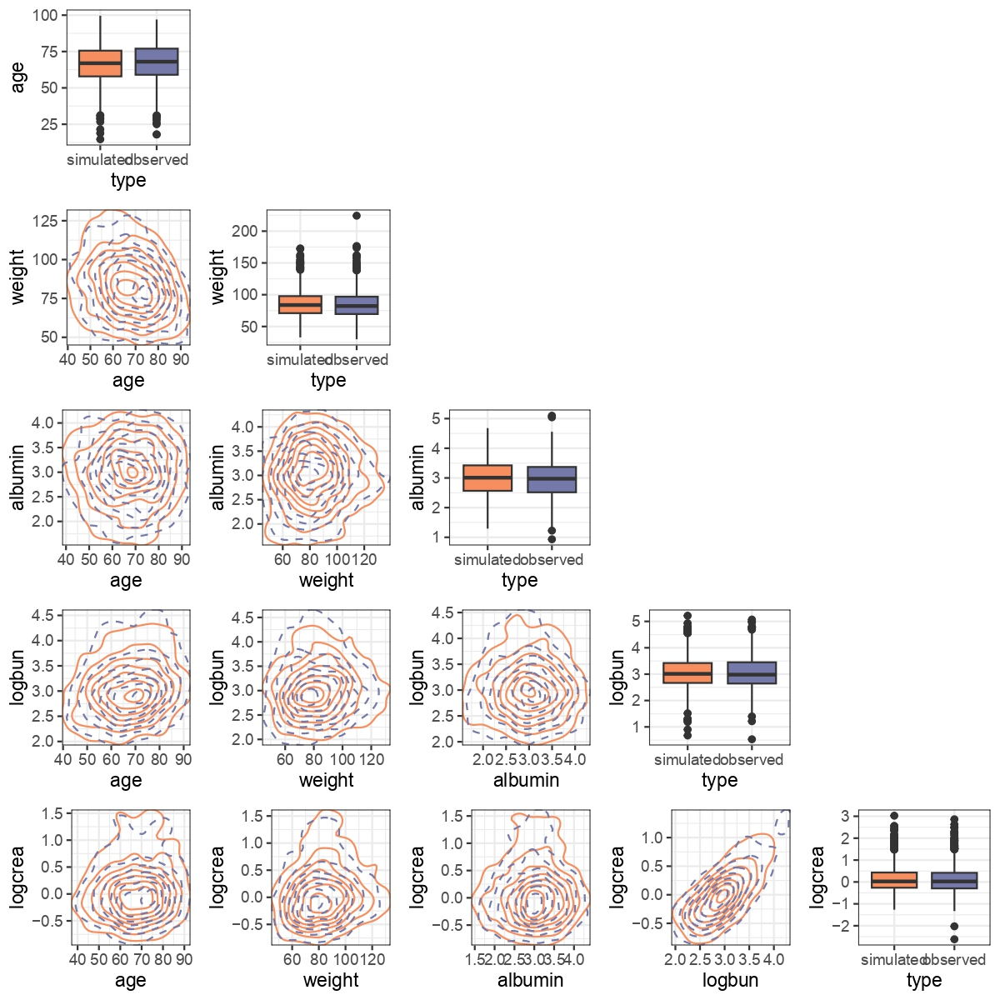
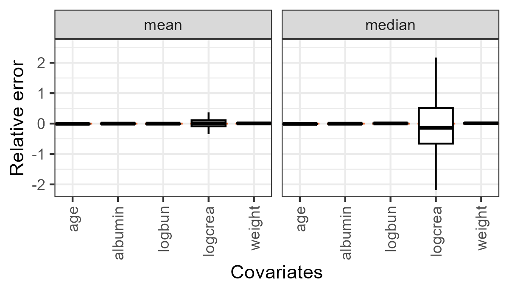
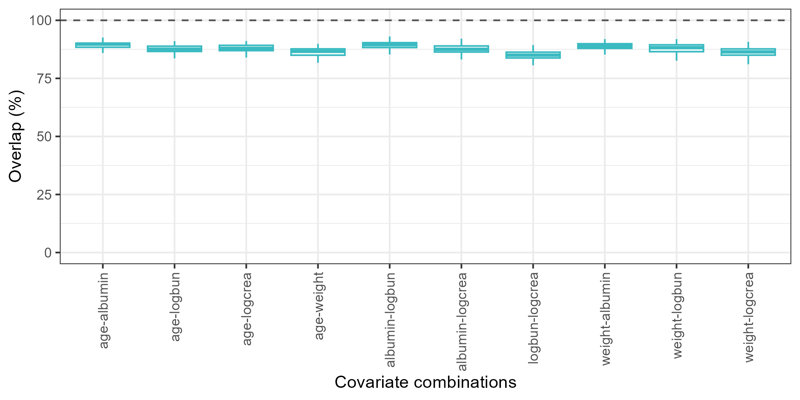
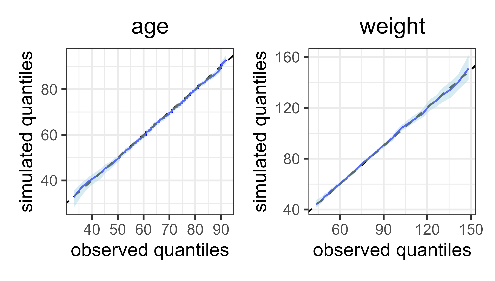
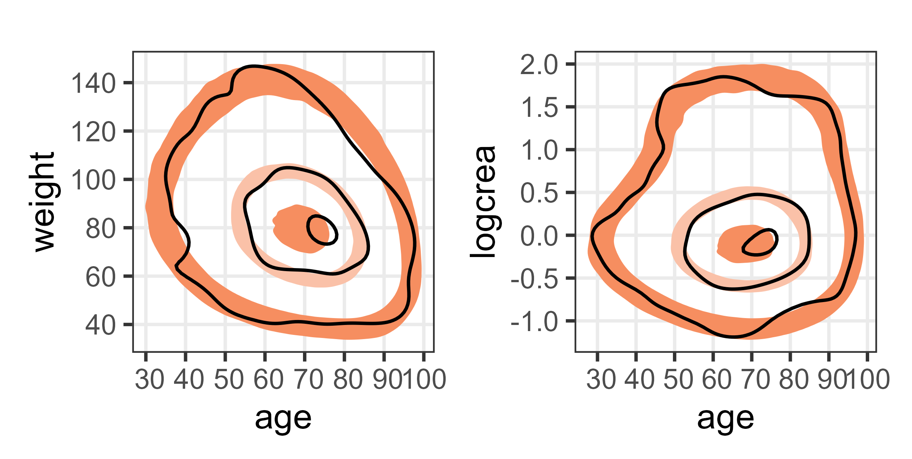
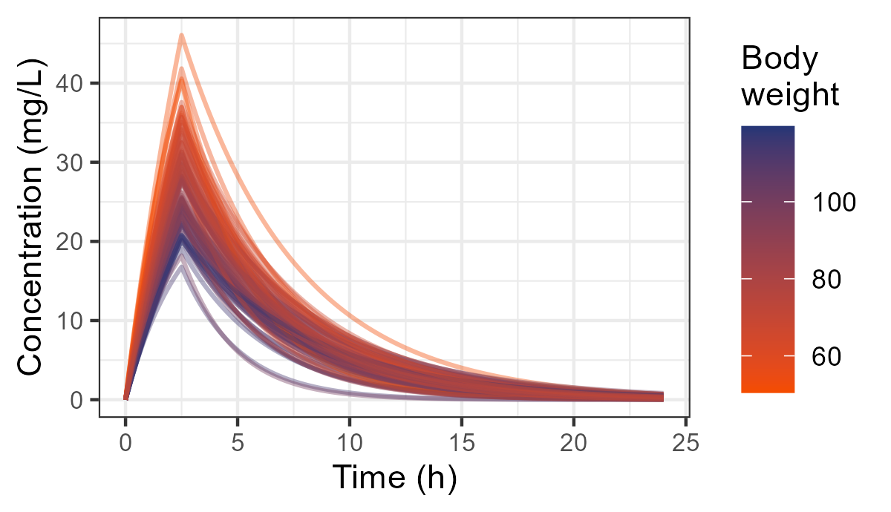

 

## Introduction

Patient-specific characteristics are commonly incorporated in pharmacometric and quantitative system pharmacology models. Realistic patient characteristics, or covariate sets, are therefore essential for obtaining reliable pharmacokinetic or pharmacodynamic predictions.

To adequately address the correlated relationship between covariates and support the generation of realistic virtual patients, we recommend using copulas, a unique class of joint distributions to model the dependence structure of observed covariate data. Once developed, copulas can be shared within the community, instead of sharing the underlying individual level data. This enables patient data to be shared and reused more easily.

This document is accompanying the tutorial **Copulas for covariate simulation in pharmacometrics** for the practical guidance on developing, evaluating and applying a copula model for generating realistic covariate sets in pharmacometric workflows


## Data

Dataset `MIMIC_5cov` from *pmxcopula* package will be used to demonstrate the whole copula modelling workflow. `MIMIC_5cov` consists of five covariates from 1000 ICU patients, based on the MIMIC database. Covariates are `age`, `weight`, serum `albumin`, log-transformed blood urea nitrogen (`logbun`) and serum creatinine (`logcrea`). 

```{r, include = FALSE}
knitr::opts_chunk$set(
  collapse = TRUE,
  comment = "#>",
  echo = T
)
```

```{r setup}
# install pmxcopula first if you haven’t done it
# devtools::install_github("vanhasseltlab/pmxcopula")
library(pmxcopula)
data("MIMIC_5cov")
```

## Copula estimation 

### Uniform transformation {#sec-intro}

The copula is estimated on uniformly distributed variables. The **probability integral transform (PIT)** utilizes cumulative distribution functions to generate uniformly distributed variables, For example, the `pnorm()` function for a normal distribution.

```{r, eval = FALSE}
age_unif <- pnorm(MIMIC_5cov$age, mean(MIMIC_5cov$age), sd(MIMIC_5cov$age))
```

The cumulative distribution function from a non-parametric distribution can also be a valid option. The package *kde1d* provides **kernel density estimation (KDE)**, a non-parametric way to estimate the probability density function and cumulative distribution function of a random variable, allowing for more flexible transformation. To estimate the kernel density, one can use:

```{r, eval = FALSE}
crea_kde <- kde1d(MIMIC_5cov$logcrea)
crea_uniform <- pkde1d(MIMIC_5cov$logcrea, crea_kde)
```

For each covariate in a dataset, KDE can be estimated using a for-loop or `lapply()` function. Below,
we create a data frame with all 5 variables transformed to the uniform scale called `MIMIC_unif`.
```{r, eval = FALSE}
kde_list <- lapply(MIMIC_5cov, kde1d)
MIMIC_unif <- mapply(function(x, kde) pkde1d(x, kde),
                     MIMIC_5cov,
                     kde_list) %>%
  as.data.frame()
```

### Copula fitting
A vine copula is fitted on the transformed data using the function `vinecop()` provided by the *rvinecopulib* package.
```{r, eval = FALSE}
library(rvinecopulib)
copula <- vinecop(MIMIC_unif, family_set = "parametric")
```

### Single-function copula development {#sec-copula}
The steps above help you understand the underlying estimation procedures of copulas. The *rvinecopulib* package also offers a comprehensive and
convenient function called `vine()`, which integrates uniform transformation, copula estimation, and back transformation for the subsequent simulation purpose.
```{r, eval = FALSE}
MIMIC_copula <- vine(MIMIC_5cov, 
                     copula_controls = list(family_set = "parametric"), 
                     margins_controls = list(mult = 1))
```

## Copula simulation
### Simulation from the model developed with `vinecop()`
With a vine copula, we can simulate a data set of, for example, 100 virtual individuals, resulting in a data.frame on the
uniform scale. To transform the uniformly distributed variables into original scales, we use again the quantile function `qkde1d()` estimated in the section [Uniform transformation](#sec-intro).
```{r, eval = FALSE}
MIMIC_sim_unif <- rvinecop(100, copula)

MIMIC_sim <- mapply(function(x, kde) qkde1d(x, kde),
                    MIMIC_sim_unif, kde_list)
```

### Simulation from the model developed with `vine()`
Covariates at the original scale can be directly simulated from the copula object estimated with `vine()` function.
```{r, eval = FALSE}
MIMIC_sim <- rvine(100, MIMIC_copula)
```
Conditional sampling is supported by *pmxcopula*, where only a subgroup of population is of interest. For example, we can generate a population aged 18-50 years, with body weight between 50~120 kg as follows:

```{r, eval = FALSE}
MIMIC_VP <- rscopula(copula = MIMIC_copula,
                     n_sim = 100,
                     xmin = c(18, 50, NA, NA, NA),
                     xmax = c(50, 120, NA, NA, NA),
                     var_types = c("c","c", "c", "c", "c"))
```

## Evaluation methods
In this section, we will mainly use evaluation tools provided by *pmxcopula* package to examine the performance of copula.
To check if the copula model can describe the observed (real-world) population well, the simulated virtual population should
resemble the observed population, so the copula evaluation is conducted using a simulation-based
strategy. First, multiple simulations of the original dataset size are done. Next, we compare the distribution properties
between observed population and simulated (virtual) populations.<br/>

We evaluate two parts of the population properties: 1) the marginal distribution, and 2) the dependency structure. In this section, we are assessing the `MIMIC_copula` from these two aspects, via the visualization of the distribution, numeric metrics and visual predictive checks. <br/>

We use `MIMIC_5cov` data set to represent the observed population, and the population simulated from `MIMIC_copula`, which is estimated in the [previous section](#sec-copula), as the virtual population.

### VP simulation for evaluation
From the copula model `MIMIC_copula`, generate a dataset named `MIMIC_sim` which contains 100 simulations of the original dataset. We use the function `rcopula()`.

```{r, eval = FALSE}
set.seed(12345)
MIMIC_sim <- rcopula(MIMIC_copula, sim_nr = 100)

```

### Visualization of distributions 
First, we visualize the density curves to assess whether the marginal distribution of observed population `MIMIC_5cov` approximate that of the simulated population `MIMIC_sim`. `var` argument can be used to select specific covariates.

```{r, eval = FALSE}
plot_1dist(sim_data = MIMIC_sim,
           obs_data = MIMIC_5cov,
           sim_nr = 100,
           pick_color = c("#F68E60",'#747AA9'))

```


```{r, fig.align='center', out.width='100%',echo = FALSE}

```

Next, we are going to visualize the density contours to compare the dependency structure of the two populations. 
```{r, eval = FALSE}
plot_mvdist(sim_data = MIMIC_sim,
            obs_data = MIMIC_5cov,
            pick_color = c("#F68E60","#747AA9"),
            plot_type = "density",
            bins = 8)

```
```{r, fig.align='center', out.width='100%',echo = FALSE}

```

### Numeric evaluation metrics

Marginal metrics, such as mean and median, can be calculated between two populations. To compare the marginal metrics (*M*) between observed and simulated population, we use the relative error (*RE*).

$$
RE = \frac{M_{sim} - M_{obs}}{M_{obs}}
$$

where *Msim* and *Mobs* represent the metrics for simulated population and observed population, respectively.

```{r, eval = FALSE}
mtr_margin <- calc_margin(sim_data = MIMIC_sim,
                         obs_data = MIMIC_5cov,
                         sim_nr = 100,
                         var = NULL,
                         aim_statistic = c("mean", "median"))
```


You can visualize these results:
```{r, eval = FALSE}
library(ggplot2)
mtr_margin %>%
  ggplot(aes(y = rel_error, x = variable)) +
  geom_hline(yintercept = 0, color = "#F46E32", linetype = 2) +
  geom_boxplot(fill = "white", color = "black",outlier.shape = NA) +
  labs(x = "Covariates", y = "Relative error") +
  scale_x_discrete(guide = guide_axis(angle = 90),
  expand = expansion(mult = 0.1)) +
  facet_grid(. ~ statistic)+
  theme_bw()

```
```{r, fig.align='center', out.width='55%',echo = FALSE}

```

The dependency metrics include the Pearson correlation and the overlap metric can be generated using the function `calc_dependency()`. The Pearson correlation quantifies the linear association, while the overlap metric takes the shape or pattern of the dependency into account.

The overlap measure computes the Jaccard index between two density contours of a certain percentile, estimated via kernel density. Since this can be computationally intensive, parallelization via multiple `core`, e.g. four cores, is recommended.

```{r, eval = FALSE}
mtr_dep <- calc_dependency(sim_data = MIMIC_sim,
                obs_data = MIMIC_5cov,
                pairs_matrix = NULL,
                percentile = 95,
                sim_nr = 100,
                cores = 4)
```

The following code demonstrates how to visualize the dependency metrics.

```{r, eval = FALSE}
mtr_dep %>%
  filter(statistic == "overlap") %>%
  ggplot(aes(y = value, x = var_pair)) +
  geom_hline(yintercept = 100, color = "#515151",linetype = "dashed") +
  geom_boxplot(outlier.shape = NA, color = "#3ABAC1") +
  labs(x = "Covariate combinations", y = "Overlap (%)") +
  coord_cartesian(ylim = c(0, 100)) +
  scale_x_discrete(guide = guide_axis(angle = 90)) +
  theme_bw()
```
```{r, fig.align='center', out.width='70%',echo = FALSE}

```

The overall fit of a copula model can also be evaluation via numeric metrics, including bootstrapped p-values for GOF test statistics and distance metrics, such as Kullback-Leibler divergence.

```{r, eval = FALSE}
library(VineCopula)
copula_model <-  RVineStructureSelect(MIMIC_unif,family = c(0:4))
MIMIC_GOFtest <-  RVineGofTest(MIMIC_unif,
                               copula_model,
                               statistic = "CvM",
                               B = 100)
MIMIC_GOFtest[["p.value"]] 

library(kldest)
kld_est_nn(MIMIC_sim %>% select(-simulation_nr), MIMIC_5cov)
```

### Visual predictive checks
Visual predictive checks (VPCs), commonly used for the evaluation of pharmacometrics models, are also applicable to copulas. 
For marginal distributions, a QQ-plot provides a comparison of all the percentiles between the multiple simulations and observed data.
```{r, eval = FALSE}
plot_qq(sim_data = MIMIC_sim,
        obs_data = MIMIC_5cov,
        sim_nr = 100,
        conf_band = 95,
        var = c("age","weight"),
        type = "ribbon")
```

```{r, fig.align='center', out.width='60%',echo = FALSE}

```

A 2-dimensional VPC, named donutVPC, was developed to evaluate the models’ fitness for the pair-wise relations. Similarly, since donutVPCs are also contour-based, using multiple cores is suggested when possible.

```{r, eval = FALSE}
donutVPC(sim_data = MIMIC_sim,
         obs_data = MIMIC_5cov,
         percentiles = c(5, 50, 95),
         sim_nr = 100,
         pairs_matrix = matrix(c("age", "age", "weight", "logcrea"), 2, 2),
         conf_band = 95,
         colors_bands = c("#F68E60",'#FAC1A8'),
         cores = 4)
```

```{r, fig.align='center', out.width='60%',echo = FALSE}

```

## Applications in pharmacometrics
Virtual populations generated from a copula model can be readily integrated into a pharmacometric simulation workflow. To demonstrate this, we first create a population PK model using creatinine and body weight as covariates, then define the dosing regimen and sampling schedule. Finally, we generate a virtual population and use it in the PK simulation.
```{r, eval = FALSE}
library(rxode2)

# create a population PK model
mod <- function() {
  ini({
    p_CL  = 10;
    p_V  = 10;
  })
  model({
    CL = (((p_CL*(weight/60)^0.75)* (creatinine/125)^0.3));
    V = (p_V * (weight /60)^1) ;
    C = centr/V ;
    d/dt(centr)   = -CL*C;
    obs = C
  })
}

# define the dosing regimen and sampling time in the event table
ev <- eventTable() %>%
  add.dosing(dose = 500,
             dosing.interval = 24,
             rate = 200) %>%
  add.sampling(seq(0, 24, by = 0.1)) %>%
  et(id = 1:100)

# format virtual population data to ensure compatibility with the model and event table
MIMIC_VP <- MIMIC_VP %>%
  mutate(id = 1:100, creatinine = exp(logcrea)))


# simulate the PK profiles with virtual populations
PK_sim <- rxSolve(mod,
                  ev,
                  iCov = MIMIC_VP %>%
                    mutate(id = 1:100,
                           creatinine = exp(logcrea)))

# visualize the PK profiles of the virtual population
ggplot(PK_sim, aes(x = time, y = obs, group = id, color = weight)) +
    geom_line(alpha = 0.4,linewidth = 0.7) +
    scale_colour_gradient(name = "weight", low = "#F54C00", high = "#243676", 
                          breaks = c(30, 50, 70, 100, 150, 200), trans = "log") +
    labs(title = "Individual PK Profiles", x = "Time (h)", y = "Concentration (mg/L)") +
    theme_bw() +
    theme(axis.text = element_text(size = 8))


```

```{r, fig.align='center', out.width='60%',echo = FALSE}

```

## Typical issues
### Discrete data
Discrete covariates are frequently encountered in phramcometric modeling applications. Before fitting a copula model with discrete covariates, their ordering must be specified. As an example, we demonstrate copula fitting in the context of treating sex and age as discrete variables.
```{r, eval = FALSE}
mix_data$Sex <- ordered(mix_data$Sex,
                        levels = c("male", "female"),
                        labels = c("1", "2"))
mix_data$Age <- ordered(mix_data$Age)
vine_discrete <- vine(dat = mix_data,
                      copula_controls = list(
                        family_set = "parametric",
                        var_types = c("d","d","c","c")))

```
